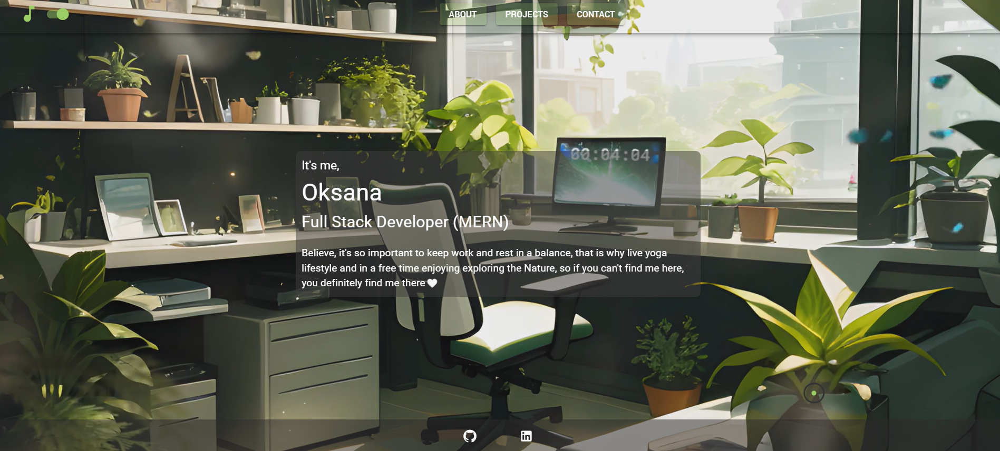
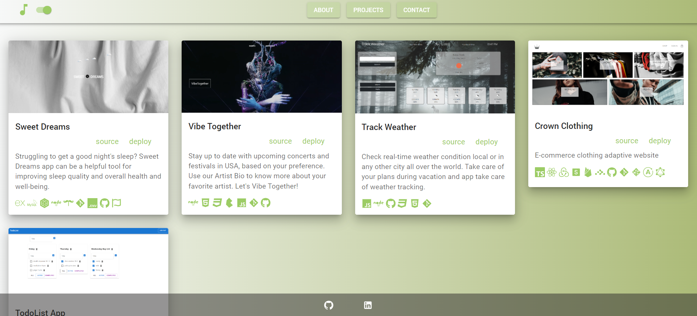
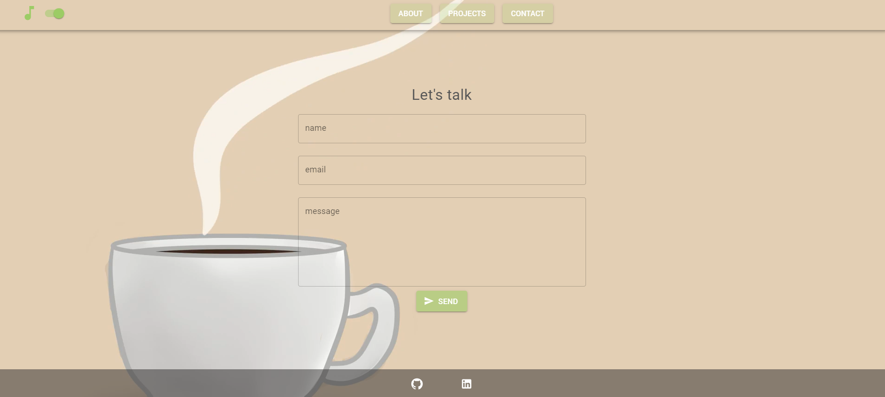

## Portfolio

Hi friend🌹 My name is Oksana Prokopieva. 

FULL STACK DEVELOPER

Enjoying be a part of IT Industry with open door to endless knowledge.

Welcome to my Portfolio🤍

## Main Used Tools
📌React ^18
📌Vite ^5
📌TypeScript ^5
📌MUI ^5

## Additional Used Tools
📍react-hook-form
📍styled-components
📍React-router-dom ^6
📍react-icons
📍react-toastify
📍uid
📍zod
📍react-animated-cursor
📍email.js
📍@hookform/resolvers
📍@mui/icons-material
📍@mui/system

## Used Coding Principals
✔️ S from SOLID
✔️ DRY
✔️ KISS

## License
Please refer to the LICENSE in the repo.

## Questions
If you have any questions find me on [GitHub](https://github.com/oprokopieva382) or feel free email me oprokopieva382@gmail.com

## Links
Check it out on the [Netlify](https://drive.google.com/file/d/1H1lnx-mghxl40kM4t6JQ0154UC3uh-LI/view)

## Screenshots

